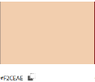
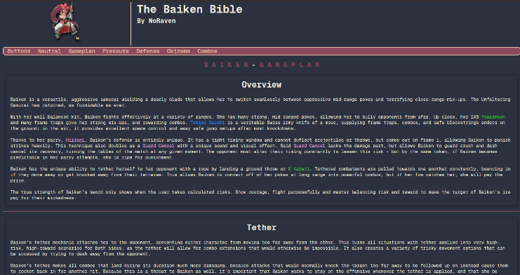
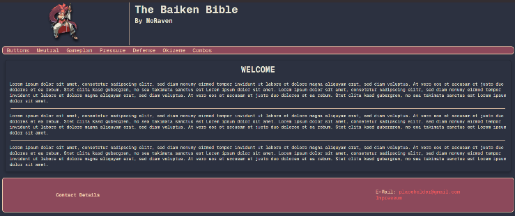
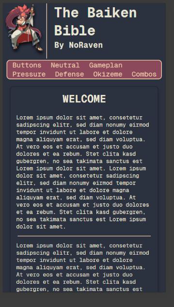

# Baiken Bible - Projekt Dokumentation

## Projektübersicht
**Projektleitung:** Tristan Casaluci  
**Betreuer:** Michi, Mike, Samira  
**Datum:** 06.12.2024  
**Firma:** Die Schweizerische Post

### Abstract
Ziel des Projekts ist die Entwicklung einer Webseite, die umfassende Informationen über den Charakter "Baiken" aus dem Videospiel **Guilty Gear Strive** bereitstellt. Die Webseite dient als Tutorial/Guide und soll neuen sowie wiederkehrenden Spielern eine einfache und schnelle Möglichkeit bieten, sich über den Charakter zu informieren und ihre Fertigkeiten zu verbessern.

---

## Projektbeschreibung

### Einführung
Im Rahmen des **WebCamps** wird eine Webseite mit statischen Inhalten erstellt. Dabei wurde das Thema "Baiken" aus Guilty Gear Strive gewählt. Die Dokumentation umfasst Planung, Design und Funktionalität der Webseite.

### Zielpublikum
Das Zielpublikum sind **Guilty Gear Strive**-Spieler, insbesondere solche, die sich für "Baiken" interessieren. Typischerweise ist die Zielgruppe zwischen **16 und 30 Jahre alt**, wobei der Stil der Webseite im Retro-Design mit matten, ruhigen Farben und einem dunklen Hintergrund gehalten ist.

---

## Anforderungen

### Funktionale Anforderungen
1. **Homepage-Icon:** Der Nutzer kann über ein Icon oben links auf die Homepage zurückkehren.
2. **Navigation:** Eine Navbar ermöglicht den Zugriff auf mehrere Seiten.
3. **Video-Steuerung:** Eingebundene Videos können abgespielt und gestoppt werden.
4. **Responsive Design:** Bilder, Videos und Texte sind sowohl auf mobilen als auch auf Desktop-Geräten gut lesbar.

### Nichtfunktionale Anforderungen
- **Farbschema:** Die Webseite wird mit maximal fünf Farben gestaltet, ausgenommen Farbcodierungen.

---

## Struktur

### Sitemap
- Baiken-button.html
- Baiken-combos.html
- Baiken-defense.html
- Baiken-gameplan.html
- Baiken-neutral.html
- Baiken-oki.html
- Baiken-pressure.html
- Homepage.html
- Impressum.html
- Submissions.html
- Submitted-submissions.html

---

## Design
Das Mokup für das Layout der Webseite sind im Reiter: Bilder untergebracht.
### Schriftarten
- **Geist Mono:** Verleiht der Webseite einen modernen und gleichzeitig retroartigen Look.

### Farbschema
Das Farbschema umfasst matte, gedämpfte Farben mit dunklem Hintergrund.
Bilder sind im Reiter: Bilder
---

## Testkonzept

### Testfälle
1. **Responsive Design:** Abschnitte wie "Throw-Okizeme" werden bei einer Breite von maximal 720 Pixeln als Block dargestellt.
2. **Icon-Funktionalität:** Ein Klick auf das Icon oben links führt zurück zur Homepage.
3. **Video-Interaktivitat:** Eingebundene Videos lassen sich abspielen und stoppen.
4. **Formular-Reset:** Nutzereingaben auf der "Submission"-Seite können durch den Reset-Button gelöscht werden.

### Testauswertung
Die meisten Tests verliefen erfolgreich. Allerdings wurde ein Problem mit langen Eingaben festgestellt, das durch eine Zeichenlimitierung behoben wurde.

---

## Fazit
Das Projekt, eine Webseite zu kreiren, ging sehr rund von statten. Da ich schon kenntnisse über HTML, CSS und JS durch das Studium hatte konnte ich mich auch sehr schnell auf das Wesentliche konzentrieren. Das Planen des Designs und Aufbau der Webseite machte grossen spass, allerdings fand ich dass Programmieren der Validierung deutlich angenehmer (Appli halt…).
Probleme hatte ich eigentlich keine. Naja, hier und da ein paar Fehlentscheidungen beim Design bzw. der Struktur der Webseite aber diese wurden schnell gefixt. Für das nächste mal sollte ich mir dort deutlich mehr Zeitnehmen damit ich am ende einfach nur noch die Tags schreiben kann.
Die Webseite ist definitiv noch nicht fertig. Es fehlen viele sachen, wie zum Beispiel Kombos, einen Pressure guide usw. Allerdings kann ich diese mit der Zeit alle sehr einfach Kreieren da die Vorlagen bzw. der Aufbau schon vorliegt und ich theoretisch nur die Paragraphen ausfüllen muss.
Später will ich dann die Webseite irgendwann (noch unklar wann genau) online stellen sodass neue Baiken spieler oder wiederkehrende ein bisschen ihr Wissen auffrischen können.
---

## Ressourcen
### Bilder

